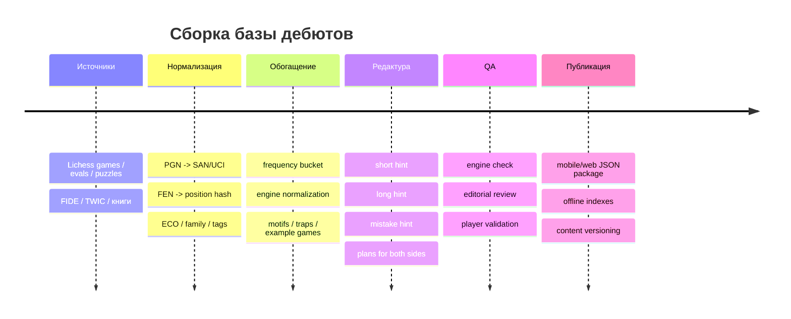
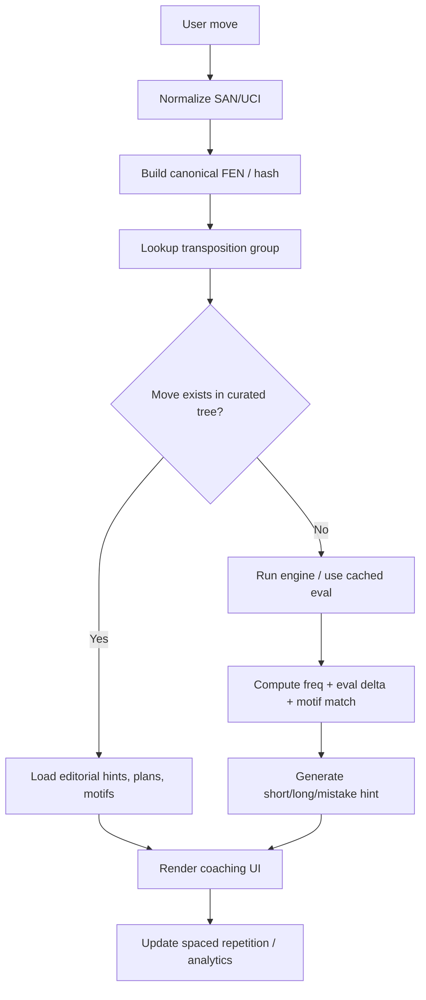

# База контента для приложения по обучению шахматным дебютам

## Исполнительное резюме

Для production-версии приложения оптимальная архитектура — не «список вариантов по ходам», а **позиционно-ориентированный граф дебютов**: одна и та же позиция может получаться разными порядками ходов, а хорошие дебютные подсказки должны быть привязаны к позиции, планам и мотивам, а не только к линейному move-order. Это соответствует тому, как работают современные дебютные базы: у entity["organization","Lichess","chess platform"] Opening Explorer названия дебютов и статистика показываются с учетом транспозиций, а официальный API Explorer дает отдельные срезы по базам мастеров, игр платформы и игроков. citeturn11view2turn5view2turn11view0

Если смотреть на источники как на основу коммерческого продукта, то самый безопасный стек такой: **машиночитаемые данные** брать из открытых выгрузок Lichess, **оценки** нормализовать фиксированной сборкой entity["organization","Stockfish","chess engine project"], **редакционные тексты** писать самостоятельно, а **примерные партии** хранить ссылками на первоисточник из entity["organization","FIDE","world chess federation"], entity["organization","The Week in Chess","chess news database"] и аналогичных ресурсов. Это важно из-за лицензий: стандартные игры, eval-база и puzzle-база Lichess доступны на условиях CC0, отдельно опубликованные broadcast PGN — под CC BY-SA 4.0, Stockfish распространяется по GPLv3, а архив TWIC прямо указывает “free for personal use only” и “all rights reserved”. Коммерционные продукты entity["company","ChessBase","chess software company"] — платные и не подходят как сырье для встраивания без лицензии. citeturn7search0turn14search1turn30search9turn31search3

По масштабу контента не стоит пытаться делать «энциклопедию всей теории» в первом релизе. Для ориентира: Opening Encyclopaedia 2026 от ChessBase заявляет 1 586 подробных статей, 40 000+ партий и 100 видеолекций; Lichess open database публикует 7.68+ млрд стандартных рейтинговых партий, 379+ млн оцененных позиций и 5.94+ млн tagged puzzles. Для обучающего приложения лучше делать **учебную библиотеку**: 35–50 дебютов, 120–220 учебных вариантов, 2–4 плана на сторону, 1–3 тактических мотива, 1–2 типичных ловушки и 1 эталонная партия на вариант. citeturn31search3turn31search1turn7search0turn33search0

По приоритету охвата логика проста: сначала **1.e4 / 1…e5, сицилианские структуры, французская, Каро-Канн, скандинавская, ферзевый гамбит, славянка, лондонская, английская**, затем уже каталан, нимцо-индийская, староиндийская, грюнфельд, бенони и редкие/гибридные системы. Это согласуется и с частотностью на Lichess opening pages: среди первых ходов белых лидируют 1.e4 (59%) и 1.d4 (26%), заметно дальше идут 1.Nf3 (4%) и 1.c4 (3%); после 1.e4 самыми частыми ответами являются …e5, …c5, …d5, …e6 и …c6. citeturn16view0turn17view0

Практическая оценка объема работ для сильного v1: **420–650 человеко-часов** на 140–180 полноценных variant cards с редактурой, движковой сверкой и QA; для «глубокой» библиотеки на 45–50 дебютов и 220+ вариантов — **700–1 100 часов**. Оффлайн-пакет с editorial JSON, индексами и локальными reference PGN-ссылками разумно закладывать в диапазоне **20–40 МБ** для v1 без встроенного движка; если добавлять более глубокие ветви и мультиязычность, пакет быстро растет. Это уже оценка проектирования, а не внешний факт, но она согласуется с масштабом доступных сырьевых данных и с тем, что для релиза нужно именно **сильное курирование**, а не только хранение PGN. citeturn7search0turn31search3

## Источники, права и методология

### Что брать в основу

| Источник | Что использовать | Плюсы | Ограничения/права | Рекомендация |
|---|---|---|---|---|
| Lichess open database | PGN игр, eval JSONL, puzzle CSV с OpeningTags | Огромный объем, машиночитаемый формат, открытая лицензия | Игры/evals/puzzles — CC0; broadcast games — CC BY-SA 4.0. citeturn7search0turn33search0 | Основной data layer |
| Lichess Opening Explorer / opening pages | Частотность, result distribution, curated opening names, master examples | Транспозиции, статистика, player/master/lichess slices | Надо соблюдать API rate limiting; лучше использовать API, не скрейпинг. citeturn11view2turn5view2turn12search3 | Основной frequency layer |
| FIDE event pages | Первоисточники для примерных партий и match context | Высокое качество, официальный турнирный контекст | Использовать как ссылки/референсы, а не копировать тексты | Основной source-of-truth для flagship examples |
| The Week in Chess | Еженедельные PGN-подборки, event pages, классификация по ECO | Огромный архив и удобство поиска игр | Архив указывает “free for personal use only” и “all rights reserved”. citeturn30search9turn30search5 | Использовать как reference/link source, не как встраиваемое сырье без разрешения |
| ChessBase Opening Encyclopaedia | Бенчмарк полноты, идеи для editorial coverage | Очень широкий охват, готовые opening articles | Платный продукт; не источник для перепаковки. citeturn31search3turn31search1 | Только как платный reference |
| Классические книги | Планы, типовые структуры, педагогическая подача | Нужно авторское объяснение, а не только moves | Тексты защищены copyright | Основа editorial layer |

### Рекомендуемый литературный набор

Для базовой редакторской работы сильнее всего подходят:

- **entity["book","Fundamental Chess Openings","van der sterren 2009"]** — охватывает все дебюты и делает акцент именно на планах и характере позиций. citeturn15search0
- **entity["book","Understanding the Chess Openings","sam collins 2005"]** — удобен как «структурный» учебник по главным линиям, типовым стратегиям и редким, но опасным ответвлениям. citeturn34search3
- **entity["book","Mastering Opening Strategy","johan hellsten 2012"]** — полезен как методическая база для написания подсказок про развитие, центр, pawn breaks и типичные ошибки. citeturn15search9turn15search6
- **entity["book","Modern Chess Openings","nick de firmian 2008"]** — удобен как reference по названиям и охвату ветвей. citeturn34search4
- **entity["book","Nunn's Chess Openings","nunn et al 1999"]** — хороший reference-стандарт по всеобъемлющему one-volume coverage. citeturn35search5

### Методологический принцип

Сильный контент для дебютного тренажера стоит разделить на три слоя:

- **Machine layer**: PGN, UCI, SAN, FEN, ECO, hash позиции, frequency bucket, engine eval, примерные PV.
- **Editorial layer**: короткая подсказка, расширенная подсказка, подсказка при ошибке, планы сторон, мотивы, ловушки.
- **Validation layer**: откуда взят вариант, кем проверен, какой движок и какой snapshot базы использовались.

Форматы PGN/FEN подходят для переносимости и проверки, а `python-chess` уже поддерживает PGN, Polyglot books и UCI-движки, что удобно для pipeline и QA. citeturn2search0turn13search3



## Каркас покрытия дебютов

### Что покрывать в первую очередь

По публичным opening pages Lichess, если ориентироваться на массовую практику, самый важный стартовый слой — 1.e4 и 1.d4, затем Nf3/c4. После 1.e4 наиболее массовые ответы — …e5, …c5, …d5, …e6, …c6; после 1.d4 d5 чаще всего встречаются Queen’s Gambit, London-style setups и Nf3 systems; после 1.c4 лидируют …e5, …Nf6 и …c5. Это означает, что MVP должен быть построен вокруг открытых игр, сицилианских структур, французской, Каро-Канн, скандинавской, ферзевого гамбита, славянки, лондона и английской. citeturn16view0turn17view0turn20view0turn22view0turn23view0turn24view2

### Каталог дебютов для v1

Ниже — **50 дебютов/вариантов** для рабочей базы запуска. Поля `Статус` и `Приоритет` — уже редакторские; exact `frequency` лучше вычислять автоматически через Opening Explorer по выбранному срезу рейтинга/контроля времени. citeturn11view0turn12search3

#### Открытые игры

| Дебют / вариант | PGN stem | ECO | Статус | Приоритет |
|---|---|---:|---|---|
| Итальянская партия: Giuoco Piano | `1.e4 e5 2.Nf3 Nc6 3.Bc4 Bc5` | C50–C54 | основной | высокий |
| Итальянская партия: Two Knights | `1.e4 e5 2.Nf3 Nc6 3.Bc4 Nf6` | C55–C59 | основной | высокий |
| Evans Gambit | `1.e4 e5 2.Nf3 Nc6 3.Bc4 Bc5 4.b4` | C51–C52 | редкий | средний |
| Испанская партия: Closed / Morphy | `1.e4 e5 2.Nf3 Nc6 3.Bb5 a6` | C70–C99 | основной | высокий |
| Испанская партия: Berlin | `1.e4 e5 2.Nf3 Nc6 3.Bb5 Nf6` | C65–C67 | основной | высокий |
| Испанская партия: Open | `1.e4 e5 2.Nf3 Nc6 3.Bb5 a6 4.Ba4 Nf6 5.O-O Nxe4` | C80–C83 | основной | средний |
| Scotch Game | `1.e4 e5 2.Nf3 Nc6 3.d4` | C44–C45 | основной | высокий |
| Vienna Game | `1.e4 e5 2.Nc3` | C25–C29 | основной | средний |
| Bishop’s Opening | `1.e4 e5 2.Bc4` | C23–C24 | основной | средний |
| Petroff Defense | `1.e4 e5 2.Nf3 Nf6` | C42–C43 | основной | высокий |
| Philidor Defense | `1.e4 e5 2.Nf3 d6` | C41 | основной | средний |
| King’s Gambit | `1.e4 e5 2.f4` | C30–C39 | редкий | средний |

#### Полуоткрытые игры после 1.e4

| Дебют / вариант | PGN stem | ECO | Статус | Приоритет |
|---|---|---:|---|---|
| Сицилианская: Open Sicilian | `1.e4 c5 2.Nf3 ... 3.d4` | B20–B99 | основной | высокий |
| Сицилианская: Najdorf | `1.e4 c5 2.Nf3 d6 3.d4 cxd4 4.Nxd4 Nf6 5.Nc3 a6` | B90–B99 | основной | высокий |
| Сицилианская: Dragon | `... 5...g6` | B70–B79 | основной | средний |
| Сицилианская: Classical / Scheveningen | `... 2...d6` / `...e6` | B56–B69 / B80–B89 | основной | высокий |
| Сицилианская: Sveshnikov | `...Nc6 ...e5` | B33 | основной | средний |
| Сицилианская: Accelerated Dragon | `...Nc6 ...g6` | B34–B39 | основной | средний |
| Сицилианская: Alapin | `1.e4 c5 2.c3` | B22 | основной | высокий |
| Smith–Morra Gambit | `1.e4 c5 2.d4 cxd4 3.c3` | B21 | редкий | средний |
| Французская: Advance | `1.e4 e6 2.d4 d5 3.e5` | C02 | основной | высокий |
| Французская: Tarrasch | `1.e4 e6 2.d4 d5 3.Nd2` | C03–C09 | основной | средний |
| Французская: Exchange | `1.e4 e6 2.d4 d5 3.exd5` | C01 | основной | высокий |
| Каро-Канн: Classical | `1.e4 c6 2.d4 d5 3.Nc3/3.Nd2 dxe4` | B18–B19 | основной | высокий |
| Каро-Канн: Advance | `1.e4 c6 2.d4 d5 3.e5` | B12 | основной | высокий |
| Каро-Канн: Panov | `1.e4 c6 2.d4 d5 3.exd5 cxd5 4.c4` | B13–B14 | основной | высокий |
| Скандинавская | `1.e4 d5 2.exd5` | B01 | основной | высокий |
| Pirc / Modern | `1.e4 d6` / `1.e4 g6` | B07–B09 | основной | средний |

#### Закрытые дебюты и игры после 1.d4

| Дебют / вариант | PGN stem | ECO | Статус | Приоритет |
|---|---|---:|---|---|
| Queen’s Gambit Declined | `1.d4 d5 2.c4 e6` | D30–D69 | основной | высокий |
| QGD Exchange / Carlsbad | `1.d4 d5 2.c4 e6 3.Nc3 Nf6 4.cxd5 exd5` | D35 | основной | высокий |
| Queen’s Gambit Accepted | `1.d4 d5 2.c4 dxc4` | D20–D29 | основной | средний |
| Slav Defense | `1.d4 d5 2.c4 c6` | D10–D19 | основной | высокий |
| Semi-Slav / Meran | `1.d4 d5 2.c4 e6 3.Nc3 c6` | D43–D49 | основной | средний |
| London System | `1.d4 d5 2.Bf4` и related move orders | D02 / A46 etc. | основной | высокий |
| Catalan | `1.d4 Nf6 2.c4 e6 3.g3` | E01–E09 | основной | средний |
| Nimzo-Indian | `1.d4 Nf6 2.c4 e6 3.Nc3 Bb4` | E20–E59 | основной | высокий |
| Queen’s Indian | `1.d4 Nf6 2.c4 e6 3.Nf3 b6` | E12–E19 | основной | средний |
| King’s Indian Defense | `1.d4 Nf6 2.c4 g6 3.Nc3 Bg7 4.e4 d6` | E60–E99 | основной | высокий |
| Grünfeld Defense | `1.d4 Nf6 2.c4 g6 3.Nc3 d5` | D70–D99 | основной | высокий |
| Dutch Defense | `1.d4 f5` | A80–A99 | основной | средний |
| Benoni Defense | `1.d4 Nf6 2.c4 c5 3.d5` | A56–A79 | основной | средний |
| Benko Gambit | `1.d4 Nf6 2.c4 c5 3.d5 b5` | A57–A59 | редкий | средний |

#### Фланговые, системные и редкие/гибридные

| Дебют / вариант | PGN stem | ECO | Статус | Приоритет |
|---|---|---:|---|---|
| English Opening: Reversed Sicilian | `1.c4 e5` | A20–A39 | основной | высокий |
| English Opening: Symmetrical | `1.c4 c5` | A30–A39 | основной | средний |
| Réti / Zukertort | `1.Nf3` | A04–A09 | основной | высокий |
| King’s Indian Attack | `1.Nf3 2.g3 3.Bg2 4.O-O 5.d3 6.e4` | A07 / A08 | основной | средний |
| Nimzo-Larsen Attack | `1.b3` | A01 | редкий | средний |
| Bird Opening | `1.f4` | A02–A03 | редкий | средний |
| Budapest Gambit | `1.d4 Nf6 2.c4 e5` | A51–A52 | редкий | средний |
| Dragondorf | Najdorf + Dragon hybrid move-order | B90/B70 hybrid | гибрид | низкий |

Отдельно полезно держать в backlog еще **Alekhine Defense, Vienna Gambit, Ponziani, Englund Gambit, Polish Opening, Owen Defense, Anti-Marshall, Rossolimo, Moscow, Torre, Colle**, но в v1 они вторичны.

### Приоритет по уровню игрока

| Уровень | Что должно быть идеально покрыто | Что можно отложить |
|---|---|---|
| Начинающий | Итальянская, Scotch, Petroff, Caro-Kann, French Exchange, Scandinavian, Queen’s Gambit, Slav, London, English basics, simple anti-Sicilians | Najdorf, Grünfeld, Semi-Slav theory, Catalan depth |
| Клубный | Ruy Lopez, Open Sicilian families, French Advance/Tarrasch, Panov, Nimzo-Indian, King’s Indian, Catalan basics, Benoni/Dutch, Réti/KIA | Очень острые sub-branches и длинные poisoned-pawn trees |
| Турнирный | Полное покрытие Ruy/Sicilian/QGD/Nimzo/KID/Grünfeld/Catalan + anti-lines, move-order traps и transposition trees | Экзотика только по запросу репертуара |

## Структура данных

### Что хранить

Для учебного приложения удобнее не просто один `line[]`, а **дерево/граф узлов** с общими префиксами и транспозициями. Базовая сущность — `openingNode`, привязанный к позиции. Формат PGN/FEN/UCI должен быть сохранен отдельно: PGN удобен для человека, UCI — для движка, FEN/hash — для быстрого поиска и дедупликации. PGN/FEN — стандартные переносимые форматы, а `python-chess` уже поддерживает чтение/запись PGN и работу с UCI engines. citeturn2search0turn13search3



### Рекомендуемая схема JSON

Ниже — схема, которая пригодна и для mobile, и для web, и для офлайн-кэша.

```json
{
  "openingId": "string",
  "openingName": "string",
  "family": "string",
  "eco": ["string"],
  "status": "mainstream | rare | hybrid",
  "difficulty": 1,
  "tags": ["string"],
  "transpositionGroupId": "string",
  "canonicalLine": {
    "pgn": "string",
    "uci": ["string"],
    "fenAfterLine": "string"
  },
  "frequency": {
    "source": "lichess_explorer",
    "scope": "masters | lichess_1600_rapid | custom",
    "bucket": "very_high | high | medium | low | rare"
  },
  "evalBaseline": {
    "cp": 0,
    "label": "equal | slight_white | slight_black | dynamic | compensation",
    "stability": "stable | dynamic"
  },
  "plans": {
    "white": ["string"],
    "black": ["string"]
  },
  "tacticalMotifs": ["string"],
  "commonTraps": [
    {
      "name": "string",
      "line": "string",
      "punishIdea": "string"
    }
  ],
  "referenceGames": [
    {
      "white": "string",
      "black": "string",
      "event": "string",
      "year": 2025,
      "result": "1-0",
      "sourceType": "fide | twic | lichess_broadcast",
      "sourceUrl": "string"
    }
  ],
  "sources": [
    {
      "type": "book | database | article | official_event",
      "title": "string",
      "url": "string"
    }
  ],
  "moves": [
    {
      "ply": 1,
      "side": "white",
      "san": "e4",
      "uci": "e2e4",
      "fen": "string",
      "eval": {
        "cp": 20,
        "label": "slight_white"
      },
      "frequencyBucket": "very_high",
      "hintShort": "1-2 предложения",
      "hintLong": "3-5 предложений",
      "hintOnMistake": "что происходит при неточности или альтернативе",
      "plansUnlocked": ["string"],
      "motifs": ["string"]
    }
  ],
  "qa": {
    "editorReviewed": true,
    "engineNormalized": true,
    "engineProfile": "stockfish_fixed_profile",
    "contentVersion": "v1.0.0"
  }
}
```

### Поля, без которых база быстро «ломается»

| Поле | Зачем нужно |
|---|---|
| `transpositionGroupId` | не дублировать один и тот же узел по разным move-orders |
| `frequency.scope` | одна и та же линия сильно меняется по rating/time-control |
| `evalBaseline.stability` | чтобы не показывать ложную точность в острых позициях |
| `referenceGames[]` | для pedagogical credibility и “смотри пример” |
| `hintOnMistake` | это главная ценность обучения, а не просто правильный ход |
| `qa.engineProfile` | чтобы оценки не плавали от версии движка и настроек |

## Эталонные карточки вариантов

Ниже — **5 полностью оформленных образцов**. Это не полная база на 50 дебютов, а **эталон для серийного заполнения** всех остальных карточек.

### Итальянская партия: Giuoco Piano

Giuoco Piano — один из лучших дебютов для основы beginner/club слоя: он одновременно тренирует развитие, борьбу за центр, давление на f7 и понимание перехода из открытия в маневренный миттельшпиль. Lichess относит 3.Bc4 к Bishop’s/Italian family, а в официальных обзорах FIDE Giuoco Piano регулярно появляется и на элитном уровне. citeturn23view2turn37search1turn37search0

| Параметр | Значение |
|---|---|
| PGN stem | `1.e4 e5 2.Nf3 Nc6 3.Bc4 Bc5` |
| ECO | `C50–C54` |
| Базовая оценка | `≈ +0.2`, небольшой удобный перевес белых |
| Планы белых | `c3 и d4`; `0-0, Re1, Nbd2-f1-g3`; `давление на f7 и e5` |
| Планы черных | `...Nf6 и ...d6/...a6`; `контроль d4`; `в нужный момент ...d5` |
| Типовые мотивы | `Bxf7+`; `вилка на e5/f7`; `темповая атака на слона c5`; `вскрытие центра d4` |
| Частые ошибки | пассивное развитие черных; преждевременное хватание пешки e4 в неготовых схемах |
| Пример партии | Aronian–Oparin, FIDE Grand Prix Berlin 2022, Giuoco Piano. citeturn37search1 |

```json
{
  "openingId": "italian-giuoco-piano-main",
  "openingName": "Итальянская партия: Джуоко Пьяно",
  "family": "Итальянская партия",
  "eco": ["C50", "C54"],
  "status": "mainstream",
  "difficulty": 2,
  "tags": ["открытая", "развитие", "центр", "позиция", "тактика"],
  "canonicalLine": {
    "pgn": "1. e4 e5 2. Nf3 Nc6 3. Bc4 Bc5",
    "uci": ["e2e4", "e7e5", "g1f3", "b8c6", "f1c4", "f8c5"],
    "fenAfterLine": "r1bqk1nr/pppp1ppp/2n5/2b1p3/2B1P3/5N2/PPPP1PPP/RNBQK2R w KQkq - 4 4"
  },
  "evalBaseline": { "cp": 20, "label": "slight_white", "stability": "stable" },
  "plans": {
    "white": [
      "Подготовить c3 и d4, чтобы захватить центр темпом.",
      "Быстро рокировать и перевести коня через d2-f1-g3.",
      "Следить за тактическим давлением на f7."
    ],
    "black": [
      "Завершить развитие и не дать белым бесплатно провести d4.",
      "Держать e5 и контроль над d4.",
      "Подготовить ...d5 только при достаточной координации фигур."
    ]
  },
  "tacticalMotifs": ["Bxf7+", "темп на слона c5", "вскрытие центра d4"],
  "commonTraps": [
    {
      "name": "Недооценка давления на e5",
      "line": "4.c3 Nf6 5.d4 exd4 6.cxd4",
      "punishIdea": "если черные отстают в развитии, центр вскрывается в пользу белых"
    }
  ],
  "moves": [
    {
      "ply": 1,
      "side": "white",
      "san": "e4",
      "uci": "e2e4",
      "hintShort": "Белые сразу берут центр и открывают линии слону c1 и ферзю.",
      "hintLong": "Это самый прямой способ начать открытую игру. Ход не только захватывает пространство, но и заранее поддерживает идеи Nf3, Bc4 и d4. Для учебного приложения это идеальный стартовый дебютный узел.",
      "hintOnMistake": "Если ученик хочет 1.Bc4 или 1.Nf3, это playable, но он уйдет в другой дебютный кластер."
    },
    {
      "ply": 2,
      "side": "black",
      "san": "e5",
      "uci": "e7e5",
      "hintShort": "Черные симметрично спорят за центр и тоже открывают свои фигуры.",
      "hintLong": "Ответ ...e5 переводит партию в класс открытых дебютов. Здесь особенно важны темп, развитие и тактика на слабом поле f7/f2. Именно такие структуры лучше всего подходят для обучения дебютным принципам.",
      "hintOnMistake": "При более асимметричных ответах вроде ...c5 игра войдет в сицилианскую структуру, где планы уже другие."
    },
    {
      "ply": 3,
      "side": "white",
      "san": "Nf3",
      "uci": "g1f3",
      "hintShort": "Конь развивается с темпом: он сразу нападает на e5.",
      "hintLong": "Это эталонный развивающий ход. Белые не только выводят фигуру, но и задают вопрос пешке e5, одновременно готовя d4. Для подсказок это хороший пример хода, который соединяет принцип развития и немедленное давление.",
      "hintOnMistake": "2.Bc4 возможно, но чаще дает черным больше свободы и меньше темпа против центра."
    }
  ]
}
```

### Испанская партия: Берлинская защита

Berlin — обязательный слой для любого серьезного каталога Ruy Lopez. На элитном уровне она стабильно используется как надежный способ уравнения и часто уводит игру либо в берлинский эндшпиль, либо в маневренные anti-Berlin структуры. В FIDE World Championship 2023 Берлин возникал в матче Nepomniachtchi–Ding. citeturn32search1turn27search2turn39search7

| Параметр | Значение |
|---|---|
| PGN stem | `1.e4 e5 2.Nf3 Nc6 3.Bb5 Nf6` |
| ECO | `C65–C67` |
| Базовая оценка | `≈ 0.0 / +0.1`, динамическое равенство |
| Планы белых | `давление на e5`; `d3, 0-0, Re1, c3`; `в эндшпиле давить на структуру черных` |
| Планы черных | `нейтрализовать инициативу`; `ускорять размены`; `использовать пару слонов и крепкую структуру` |
| Типовые мотивы | `атака на e5`; `ход ...Nd6`; `Bxc6 и испорченная структура` |
| Частые ошибки | путать допустимое `...Nxe4` с move-orders, где оно тактически не работает |
| Пример партии | Nepomniachtchi–Ding, World Championship 2023, game 9. citeturn27search2 |

```json
{
  "openingId": "ruy-lopez-berlin-main",
  "openingName": "Испанская партия: Берлинская защита",
  "family": "Испанская партия",
  "eco": ["C65", "C67"],
  "status": "mainstream",
  "difficulty": 4,
  "tags": ["открытая", "позиция", "эндшпиль", "маневр", "элита"],
  "canonicalLine": {
    "pgn": "1. e4 e5 2. Nf3 Nc6 3. Bb5 Nf6",
    "uci": ["e2e4", "e7e5", "g1f3", "b8c6", "f1b5", "g8f6"],
    "fenAfterLine": "r1bqkb1r/pppp1ppp/2n2n2/1B2p3/4P3/5N2/PPPP1PPP/RNBQK2R w KQkq - 4 4"
  },
  "evalBaseline": { "cp": 10, "label": "equal_dynamic", "stability": "dynamic" },
  "plans": {
    "white": [
      "Развиваться без спешки и держать контроль над e5.",
      "В anti-Berlin структурах удобно ставить пешку c3 и готовить d4.",
      "Если возникает берлинский эндшпиль, играть на лучшую пешечную структуру и king activity."
    ],
    "black": [
      "Нейтрализовать инициативу белых и упростить позицию.",
      "Следить за своевременным ...d6/...Be7 или переходом в эндшпиль.",
      "Использовать надежность структуры и активность короля в берлинских окончаниях."
    ]
  },
  "tacticalMotifs": ["давление на e5", "...Nd6", "Bxc6"],
  "commonTraps": [
    {
      "name": "Автоматическое ...Nxe4 вне нужного move-order",
      "line": "в anti-Berlin схемах жадный захват e4 может проигрывать темп и центр",
      "punishIdea": "Re1 и d4 быстро вскрывают позицию"
    }
  ],
  "moves": [
    {
      "ply": 5,
      "side": "white",
      "san": "Bb5",
      "uci": "f1b5",
      "hintShort": "Слон не берет коня, а давит на защитника поля e5.",
      "hintLong": "Смысл испанской — не в немедленном размене, а в долгом позиционном давлении. Белые косвенно атакуют e5 и готовят развитие без ухудшения структуры. Для обучающей подсказки важно прямо проговаривать этот скрытый смысл.",
      "hintOnMistake": "3.Bc4 ведет в итальянскую, где логика игры более прямая и тактическая."
    },
    {
      "ply": 6,
      "side": "black",
      "san": "Nf6",
      "uci": "g8f6",
      "hintShort": "Черные не защищают пешку пассивно и сразу контратакуют e4.",
      "hintLong": "Берлинский ход хорош тем, что сочетает развитие и контрдавление. Черные не ослабляют структуру и оставляют себе несколько надежных схем. Для движка и контентной модели это типичный пример динамического равенства, а не 'сухой' ничьей как таковой.",
      "hintOnMistake": "Если ученик играет ...a6 вместо ...Nf6, это уже другая большая ветка Испанской."
    }
  ]
}
```

### Сицилианская защита: Najdorf

Najdorf — ядро advanced-каталога: огромное количество теории, асимметрия, богатые атакующие и позиционные планы. На практике это одна из важнейших открытых систем после 1.e4; у Lichess в сицилианском кластере `2.Nf3` ведет в открытые структуры, а современные турниры регулярно дают Najdorf-партии. В Candidates 2022 FIDE отдельно разбирала Najdorf line в партии Nakamura–Firouzja. citeturn21view0turn24view2turn36search1

| Параметр | Значение |
|---|---|
| PGN stem | `1.e4 c5 2.Nf3 d6 3.d4 cxd4 4.Nxd4 Nf6 5.Nc3 a6` |
| ECO | `B90–B99` |
| Базовая оценка | `≈ 0.0`, острое динамическое равновесие |
| Планы белых | `English Attack`; `Be2 and pressure on d5`; `жертвы на e6 и нажим по kingside` |
| Планы черных | `...e5 или ...e6`; `...b5 и игра на ферзевом фланге`; `контроль d5 и давление на e4` |
| Типовые мотивы | `форпост Nd5`; `жертва на e6`; `…Rxc3`; `гонка фланговых атак` |
| Частые ошибки | ослабление d5; жадность в центре; автоматическое раскрытие короля при плохой координации |
| Пример партии | Nakamura–Firouzja, Candidates 2022, Najdorf line. citeturn36search1 |

```json
{
  "openingId": "sicilian-najdorf-main",
  "openingName": "Сицилианская защита: вариант Найдорфа",
  "family": "Сицилианская защита",
  "eco": ["B90", "B99"],
  "status": "mainstream",
  "difficulty": 5,
  "tags": ["полуоткрытая", "тактика", "контратака", "асимметрия", "теория"],
  "canonicalLine": {
    "pgn": "1. e4 c5 2. Nf3 d6 3. d4 cxd4 4. Nxd4 Nf6 5. Nc3 a6",
    "uci": ["e2e4", "c7c5", "g1f3", "d7d6", "d2d4", "c5d4", "f3d4", "g8f6", "b1c3", "a7a6"],
    "fenAfterLine": "rnbqkb1r/1p1ppppp/p2p1n2/8/3NP3/2N5/PPP2PPP/R1BQKB1R w KQkq - 0 6"
  },
  "evalBaseline": { "cp": 0, "label": "equal_dynamic", "stability": "dynamic" },
  "plans": {
    "white": [
      "Выбрать либо прямую атаку на короля, либо более позиционное давление на d5.",
      "Ускорить развитие и решить, куда рокировать.",
      "Использовать перевес в развитии раньше, чем черные развернут пешки на ферзевом фланге."
    ],
    "black": [
      "Подготовить ...e5 или ...e6 и не отдать d5.",
      "Развернуть ...b5 и контригру на ферзевом фланге.",
      "Выиграть время на белой рокировке и использовать асимметрию."
    ]
  },
  "tacticalMotifs": ["Nd5", "Bxe6", "...Rxc3", "вскрытие линии c"],
  "commonTraps": [
    {
      "name": "Ослабленное поле d5",
      "line": "небрежное ...e5 или размены без контроля d5",
      "punishIdea": "белый конь закрепляется на d5 и структура черных теряет гибкость"
    }
  ],
  "moves": [
    {
      "ply": 2,
      "side": "black",
      "san": "c5",
      "uci": "c7c5",
      "hintShort": "Черные не копируют центр, а атакуют его сбоку и создают асимметрию.",
      "hintLong": "Сицилианская — не про симметрию, а про контригру. Черные готовы отдать белым чуть больше пространства в центре, чтобы получить активную игру и разные фланги атаки. Именно поэтому подсказки в сицилианке должны быть не только 'про развитие', но и 'про структуру'.",
      "hintOnMistake": "Если ученик ожидал ...e5, надо объяснить, что здесь меняется тип позиции: от открытой к полуоткрытой."
    },
    {
      "ply": 10,
      "side": "black",
      "san": "a6",
      "uci": "a7a6",
      "hintShort": "Ход не 'про край доски', а про контроль b5 и подготовку ...b5.",
      "hintLong": "Najdorf почти всегда требует объяснять скрытый смысл. ...a6 не выигрывает центр напрямую, но ограничивает легкие фигуры белых, поддерживает ферзевофланговое расширение и делает план черных очень гибким. Это образцовый ход для длинной подсказки типа 'профилактика + подготовка pawn break'.",
      "hintOnMistake": "Если черные играют слишком быстро ...e5/...e6 без профилактики, у белых часто появляются более простые активные планы."
    }
  ]
}
```

### Французская защита: Advance Variation

French Advance важна педагогически: она учит pawn-chain logic, подрывы `...c5` и `...f6`, а также идею, что закрытая структура не равна «медленной» партии. По TWIC, такие партии стабильно встречаются в сильных национальных и женских элитных турнирах, включая Tata Steel 2025 и Women’s Grand Prix 2025. citeturn21view1turn39search7turn39search5

| Параметр | Значение |
|---|---|
| PGN stem | `1.e4 e6 2.d4 d5 3.e5` |
| ECO | `C02` |
| Базовая оценка | `≈ +0.2`, пространство белых против контригры черных |
| Планы белых | `удержать цепь e5–d4`; `развиваться с Nf3, Be2, 0-0`; `атаковать на kingside и не дать ...f6 бесплатно` |
| Планы черных | `подрыв ...c5`; `давление на d4`; `в подходящий момент ...f6` |
| Типовые мотивы | `атака базы цепи`; `прорыв ...f6`; `Bxh6 / Qg4 motifs`; `пространственный захват белых` |
| Частые ошибки | белые переоценивают пространство и запаздывают с развитием; черные проводят ...f6 без подготовки |
| Пример партии | Gukesh–Harikrishna, Tata Steel 2025; Muzychuk–Kosteniuk, Women’s GP 2025. citeturn39search7turn39search5 |

```json
{
  "openingId": "french-advance-main",
  "openingName": "Французская защита: вариант Advance",
  "family": "Французская защита",
  "eco": ["C02"],
  "status": "mainstream",
  "difficulty": 4,
  "tags": ["полуоткрытая", "цепь пешек", "позиция", "контригра", "структура"],
  "canonicalLine": {
    "pgn": "1. e4 e6 2. d4 d5 3. e5",
    "uci": ["e2e4", "e7e6", "d2d4", "d7d5", "e4e5"],
    "fenAfterLine": "rnbqkbnr/pp3ppp/4p3/3pP3/3P4/8/PPP2PPP/RNBQKBNR b KQkq - 0 3"
  },
  "evalBaseline": { "cp": 20, "label": "slight_white_dynamic", "stability": "dynamic" },
  "plans": {
    "white": [
      "Использовать пространство и не потерять темп в развитии.",
      "Поддерживать центр и следить за базой пешечной цепи d4.",
      "Готовить kingside play только после завершения базовой координации."
    ],
    "black": [
      "Бить по базе цепи через ...c5 и ...f6.",
      "Не дать белым бесплатно закрепить e5 и d4.",
      "Решить проблему слона c8 активным развитием или разменом."
    ]
  },
  "tacticalMotifs": ["подрыв ...f6", "давление на d4", "маневр Nd7-f8-g6", "удар по h2/h7"],
  "commonTraps": [
    {
      "name": "Преждевременный ...f6",
      "line": "черные вскрывают центр без полной координации",
      "punishIdea": "пространство белых превращается в атаку по открытым линиям"
    }
  ],
  "moves": [
    {
      "ply": 5,
      "side": "white",
      "san": "e5",
      "uci": "e4e5",
      "hintShort": "Белые закрывают центр и выигрывают пространство.",
      "hintLong": "Advance — не просто уход от разменов. Ход e5 ограничивает коня f6, задает пешечную цепь и сразу меняет тип дебютной борьбы: теперь главное — не счет темпов сам по себе, а борьба за базы цепей и pawn breaks. Это один из лучших дебютов для объяснения стратегических подсказок.",
      "hintOnMistake": "Если ученик берет на d5, то он переходит в Exchange French с другим структурным типом."
    }
  ]
}
```

### Ферзевый гамбит отказанный: Exchange / Carlsbad

QGD Exchange — один из лучших дебютов для обучения **структурам**, а не заучиванию. В матче за мировую корону 2023 FIDE прямо отмечала Carlsbad variation of the exchange line; QGD Exchange также регулярно встречается в сильных турнирах вроде Tata Steel 2025 и US Championship 2025. citeturn28search5turn39search7turn39search3

| Параметр | Значение |
|---|---|
| PGN stem | `1.d4 d5 2.c4 e6 3.Nc3 Nf6 4.cxd5 exd5` |
| ECO | `D35` |
| Базовая оценка | `≈ +0.2`, спокойный перевес белых за счет плана |
| Планы белых | `minority attack b4-b5`; `фигурное давление на c-file/e5`; `контроль e5` |
| Планы черных | `центральный break ...c5`; `игра на kingside`; `активизация слоновой пары` |
| Типовые мотивы | `minority attack`; `слабая пешка c6/c7`; `поле e5`; `good knight vs bad bishop scenarios` |
| Частые ошибки | белые играют 'по шаблону' без подготовки b4; черные пассивно ждут и не проводят ...c5 вовремя |
| Пример партии | Nepomniachtchi–Ding, World Championship 2023, game 3. citeturn28search5 |

```json
{
  "openingId": "qgd-exchange-carlsbad",
  "openingName": "Ферзевый гамбит отказанный: разменный вариант, Карлсбад",
  "family": "Ферзевый гамбит",
  "eco": ["D35"],
  "status": "mainstream",
  "difficulty": 3,
  "tags": ["закрытая", "структура", "позиция", "minority_attack", "плановая_игра"],
  "canonicalLine": {
    "pgn": "1. d4 d5 2. c4 e6 3. Nc3 Nf6 4. cxd5 exd5",
    "uci": ["d2d4", "d7d5", "c2c4", "e7e6", "b1c3", "g8f6", "c4d5", "e6d5"],
    "fenAfterLine": "rnbqkb1r/ppp2ppp/5n2/3p4/3P4/2N5/PP2PPPP/R1BQKBNR w KQkq - 0 5"
  },
  "evalBaseline": { "cp": 20, "label": "slight_white", "stability": "stable" },
  "plans": {
    "white": [
      "Подготовить minority attack на ферзевом фланге.",
      "Контролировать e5 и улучшать фигуры перед pawn break.",
      "Играть против слабостей, а не 'за мат'."
    ],
    "black": [
      "Не быть пассивным: центральный break ...c5 часто критичен.",
      "Использовать kingside activity и инициативу слонов.",
      "Не дать белым провести b4-b5 в комфортных условиях."
    ]
  },
  "tacticalMotifs": ["minority attack", "слабая пешка c", "форпост e5", "...c5 break"],
  "commonTraps": [
    {
      "name": "Автопилотный minority attack",
      "line": "белые начинают b4-b5 без фигурной подготовки",
      "punishIdea": "черные вскрывают центр и получают контригру быстрее, чем создается слабость"
    }
  ],
  "moves": [
    {
      "ply": 7,
      "side": "white",
      "san": "cxd5",
      "uci": "c4d5",
      "hintShort": "Белые сознательно меняют напряжение на понятную пешечную структуру.",
      "hintLong": "Размен здесь — не отказ от борьбы, а выбор стратегической модели. Белые получают знакомый Carlsbad-type план с minority attack и полем e5, а черные — шансы на контригру в центре и на королевском фланге. Это отличный дебют для обучения 'игре по плану'.",
      "hintOnMistake": "Если ученик держит напряжение дольше, он остается в основных линиях QGD, где теория и move-order сложнее."
    }
  ]
}
```

## UX и алгоритм генерации подсказок

### Функции, которые действительно добавляют ценность

Лучший UX для такого приложения — не «анализатор, который всегда говорит лучший ход», а **контекстный тренер**:

- подсказка в реальном времени по выбранному репертуару;
- drill mode по веткам;
- memory test без досказки;
- filters по уровню, дебюту, тегам, статусу `редкий/гибрид`;
- примерная партия из первоисточника на каждый вариант;
- офлайн-режим с локальным JSON-пакетом;
- движок только как **валидация и объяснитель**, а не как единственный источник смысла.

### Алгоритм подсказок

Ключевой вывод из источников: открытые статистические и eval-данные сами по себе неоднородны. Lichess eval export прямо пишет, что оценки позиционно хранятся с разной глубиной и количеством нод; при выборе одной PV рекомендуют брать самый глубокий eval. Stockfish, со своей стороны, предупреждает, что MultiPV полезен для обзора вариантов, но ухудшает качество «лучшей линии» по сравнению с single-PV поиском. Поэтому для приложения canonical evaluation нужно считать **фиксированным профилем движка**, а внешние eval-выгрузки использовать как bootstrap/cache. citeturn33search0turn12search2turn12search0

Рекомендуемый pipeline:

1. **Нормализовать ход** в `SAN`, `UCI`, `FEN` и `positionHash`.
2. **Найти transposition group**.
3. Если ход есть в curated tree:
   - показать editorial hint;
   - подгрузить планы, мотивы, ловушки и примерную партию.
4. Если хода нет:
   - получить single-PV оценку из локального/серверного Stockfish;
   - при необходимости взять MultiPV=3 только для объяснения альтернатив;
   - сравнить ход пользователя с движковой baseline и частотностью.
5. Сформировать класс отклонения:
   - `Δcp <= 20` → нормальная альтернатива / транспозиция;
   - `20 < Δcp <= 80` → playable but less precise;
   - `80 < Δcp <= 180` → неточность;
   - `> 180` или форсированный тактический refutation → ошибка/зевок.
6. Выдать подсказку в трех слоях:
   - **short**: цель хода;
   - **long**: идея + структура + чем угрожает;
   - **mistake**: что ломается и какой тип наказания возможен.
7. Зафиксировать событие в памяти пользователя для spaced repetition.

### Откуда брать данные для автоматического enrichment

| Что нужно | Откуда брать | Как использовать |
|---|---|---|
| Частотность хода | Opening Explorer `masters/lichess/player` | bucket для UX: very_high / high / medium / low |
| Оценка позиции | fixed-profile Stockfish | baseline для карточки |
| Альтернативы | Stockfish MultiPV | только для expanded hint, не для canonical best move |
| Типовые мотивы и ловушки | Lichess puzzles с `OpeningTags` и themes | автоматический candidate mining |
| Игровые примеры | FIDE / TWIC / Lichess broadcast | “study this game” block |

Lichess puzzle export особенно ценен тем, что содержит и themes, и `OpeningTags`; при этом opening tags проставляются для задач, начинающихся до 20-го хода. Это почти идеальный материал для полуавтоматического поиска тактических мотивов и ловушек по дебютам. citeturn33search0

### Практические правила генерации текстов

Вот рабочая формула для подсказок:

- если ход **развивающий**, текст начинается с функции фигуры и центра;
- если ход **профилактический**, текст начинается с “не пускает/ограничивает/готовит”;
- если ход **структурный**, текст должен назвать целевую слабость или pawn break;
- если ход **транспозиционный**, текст должен прямо сказать “мы можем перейти в …”;
- если позиция **острая**, сначала объясняем угрозу, потом оценку;
- если позиция **равная, но сложная**, показываем не `0.00`, а ярлык вроде “динамическое равновесие”.

Для бекенда лучше использовать официальный API, а не неформальный скрейпинг; Lichess прямо советует пользоваться API и напоминает про ограничение “one request at a time” и паузу после 429. citeturn12search3

## Объем контента, хранение и индексация

### Реалистичный объем для продукта

Полезно мыслить не «сколько дебютов», а **сколько variant cards**. Один дебют может требовать 2 карточки для beginner-слоя и 8–12 карточек для tournament-слоя.

| Слой | Дебюты | Variant cards | Что внутри | Оценка трудозатрат |
|---|---:|---:|---|---:|
| MVP | 15–20 | 45–70 | short hints, базовые планы, 1 примерная партия | 160–260 ч |
| Launch v1 | 35–40 | 120–180 | short + long + mistake hints, мотивы, ловушки, filters | 420–650 ч |
| Deep library | 45–50 | 220–280 | глубже теория, anti-lines, move-order traps, richer example bank | 700–1 100 ч |

Это не попытка догнать ChessBase-level encyclopedia. И это правильно: даже коммерческая Opening Encyclopaedia опирается на 1 586 статей и 40 000+ партий. Для учебного приложения сильнее работает curated pedagogy, а не максимальная плотность теории. citeturn31search3turn31search1

### Что хранить локально

Рекомендуемая структура офлайн-данных:

- `openings.json` — metadata по дебютам;
- `nodes.db` или `nodes.sqlite` — graph узлов и хеши позиций;
- `hints.jsonl` — editorial texts;
- `examples.json` — ссылки на примерные партии и краткие summaries;
- `analytics_event_map.json` — mapping для A/B и spaced repetition.

### Индексация

Минимальный набор индексов:

| Индекс | Для чего |
|---|---|
| `positionHash` | мгновенный lookup позиции |
| `transpositionGroupId` | не дублировать одну позицию |
| `family + eco` | быстрые фильтры по дебюту |
| `tags + difficulty + status` | рекомендации и discoverability |
| `sourceSnapshotDate + engineProfile` | reproducibility |
| `userScore/openingId/nodeId` | адаптивная тренировка |

Технически для web подойдет `IndexedDB` или SQLite WASM; для mobile — SQLite/Room/Core Data. Если делать tree как flat table `nodes(parentId, move, fenHash, openingId)`, то UI, drills и рекомендациям будет проще, чем при хранении только PGN-строк.

### Оценка размера

Практический ориентир:

- **MVP**: 8–15 МБ editorial package;
- **Launch v1**: 20–40 МБ;
- **Deep library**: 40–90 МБ.

Это оценка **без учета самого движка**. Движок лучше не включать жестко в основной package для web и low-end mobile, а подгружать профильно: серверный eval для сети и локальный eval только для offline/analysis mode.

## Тестирование, валидация и ограничения

### Критерии качества подсказок

Подсказка считается качественной, если одновременно выполняются пять требований:

| Критерий | Проверка |
|---|---|
| Теоретическая корректность | ход совпадает с curated tree или движковым baseline для scope |
| Педагогическая ясность | пользователь понимает **зачем**, а не только **что** |
| Краткость | short hint ≤ 160 символов; long hint ≤ 350–450 символов |
| Конкретность | названа цель: центр, развитие, weak square, pawn break, threat |
| Непереоценка | текст не обещает “выигрывает”, если позиция просто удобнее |

### Метрики

Ниже — набор метрик, которые реально полезны в A/B:

| Метрика | Что измеряет |
|---|---|
| Recall Accuracy | процент правильных ходов по памяти |
| First-Try Accuracy | найден ли ход без подсказки |
| Hint Helpfulness Score | субъективная полезность после хода |
| Branch Confusion Rate | как часто пользователь путает близкие ветки |
| Time-to-Recall | время до правильного хода |
| Engine Agreement Rate | процент карточек, где редакторская линия не расходится с baseline beyond threshold |
| Trap False Positive Rate | как часто «ловушка» на деле не работает при точной защите |

### План валидации с игроками

Рекомендуемая схема валидации:

- **когорта 600–1200**: проверять, понимают ли они short hints и не перегружены ли терминами;
- **когорта 1200–1800**: проверять, улучшается ли recall и понимание планов;
- **когорта 1800–2200**: проверять, не слишком ли поверхностны тексты и корректны ли tricky move-orders.

A/B тесты:

| Тест | A | B | Что считать успехом |
|---|---|---|---|
| Формат подсказки | короткая → длинная по tap | сразу длинная | выше recall при той же completion rate |
| Порядок объяснения | план-first | tactic-first | меньше ошибок в sharp lines |
| Отображение оценки | label only | centipawns + label | выше доверие без просадки retention |
| Пример партии | до тренировки | после тренировки | выше post-test accuracy |
| Drill order | fixed line | spaced repetition with branch weighting | меньше forgetting between sessions |

### Ограничения и открытые вопросы

- В этом отчете приведен **полный каркас** и **5 эталонных заполненных карточек**, но не все 50 вариантов заполнены в одинаковой глубине. Для production-пакета оставшиеся варианты нужно заполнить по той же схеме.
- Exact `frequency` по каждому variant card лучше считать автоматически через Opening Explorer по выбранному срезу рейтинга/контроля времени, а не фиксировать вручную из одного публичного snapshot. citeturn11view0turn12search3
- Для коммерческого запуска нельзя без отдельного правового решения встраивать raw-контент из TWIC/ChessBase как собственную базу. Безопасный маршрут — Lichess CC0 data + собственные редакторские тексты + ссылки на первоисточники. citeturn30search9turn31search3turn7search0
- Если нужен “режим движка” в офлайне, заранее определите лицензирование и дистрибуцию Stockfish: GPLv3 требует правильной поставки исходников/ссылки на код при распространении бинарей. citeturn14search1
